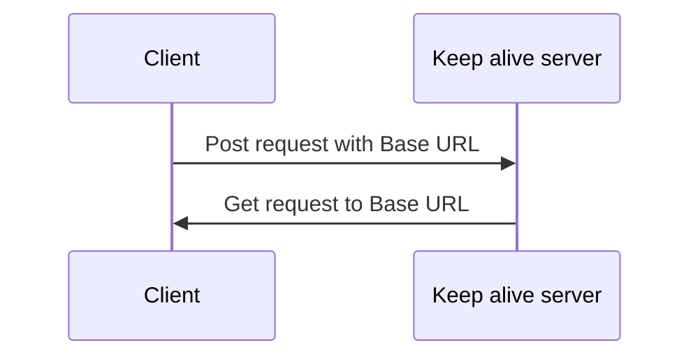

# KeepAlive Server

This server helps you to automatically call your application's API, in order to prevent inactivity.


## How it works
It is designed to work like that:


## How to use it

To launch the server, run:
```bash
$ uvicorn main:app
```

To use it with live reload, run:
```bash
$ uvicorn main:app --reload
```

To use it with a custom port, run:
```bash
$ uvicorn main:app --port 8000
```

To use it with all IPs, run:
```bash
$ uvicorn main:app --host 0.0.0.0
```
